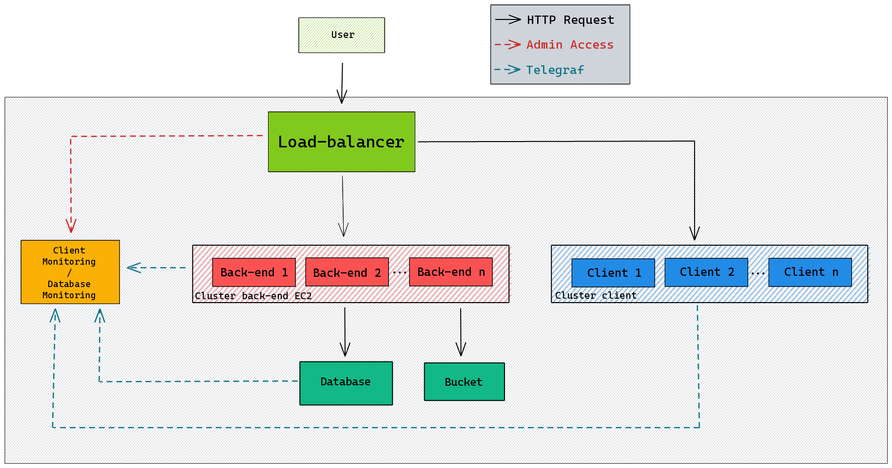

# Schema infrastructure

# Detail

- Load-balancer : 
	Træfik => 
	- Dispatch between multi front servers, multi back server and front of monitoring server. 
	- Bring https for application

	Ports =>
	
	| Port | Protocol | Application                  |
	| ---- | -------- | ---------------------------- |
	| 22   | SSH      | SSH access to server         |
	| 80   | HTTP     | HTTP access, redirect to 443 |
	| 443  | HTTPS    | HTTPS access, load balancing |
	| 8080 | HTTP     | Traefik dashboard            | 

- Back-end :
	PHP/Laravel =>
	- API for front and mobile application
	
	Telegraf =>
	- Send server status and metrics to monitoring database

	Ports =>
	
	| Port | Protocol | Application               |
	| ---- | -------- | ------------------------- |
	| 22   | SSH      | SSH access to server      |
	| 80   | HTTP     | HTTP access to API | 

- Front-end :
	JS/Vue =>
	- Web client of application
	
	Telegraf =>
	- Send server status and metrics to monitoring database

	Ports =>
	
	| Port | Protocol | Application               |
	| ---- | -------- | ------------------------- |
	| 22   | SSH      | SSH access to server      |
	| 80   | HTTP     | HTTP access to client app | 
	

- Database : 
	MariaDB =>
	- Database of application

	Telegraf =>
	- Send server status and metrics to monitoring database

	Ports =>

	| Port | Protocol | Application          |
	| ---- | -------- | -------------------- |
	| 22   | SSH      | SSH access to server |
	| 3306 | TCP      | MariaDB access       |

- Monitoring :
	Grafana =>
	- Front client for monitoring
	- Connection with InfluxDB
	- Dashboard for server's metrics

	InfluxDB =>
	- Time database for metrics
	- Save metrics from Telegraf

	Ports => 

| Port | Protocol | Application                   |
| ---- | -------- | ----------------------------- |
| 22   | SSH      | SSH access to server          |
| 80   | HTTP     | HTTP access to Grafana client | 
| 8086 | TCP      | InfluxDB access               |

